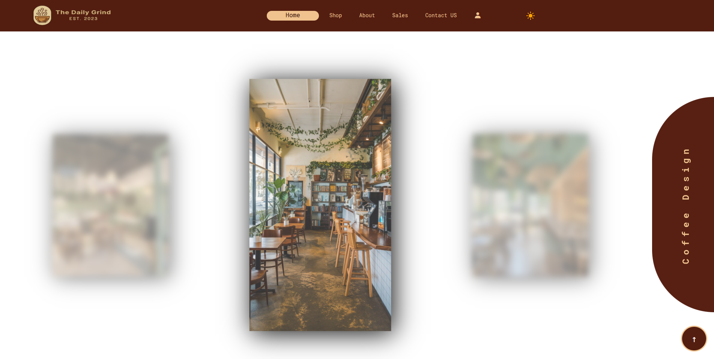

# IT Coffee Project

A front-end coffee shop website with product browsing, authentication pages, cart/checkout flow, and dark mode support.

## Features
- Multi-page website (`Home`, `Shop`, `Contact`, `Login`, `Signup`, `Cart`, `Checkout`, `Thank You`)
- Product detail pages for coffee, bakery, and dessert items
- Cart logic using `localStorage`
- Checkout total persistence
- Light and dark mode toggle

## Tech Stack
- HTML5
- CSS3
- Vanilla JavaScript

## Project Structure
```text
src/
  assets/        images, icons, and video
  pages/         main pages
  pages/products product detail pages
  scripts/       cart, checkout, home, dark mode logic
  styles/        global and page styles
  styles/products product page styles
ScreenShots/     README showcase images
```

## Run Locally
1. Clone the repository.
2. Open `src/pages/index.html` in a browser.

## Data Persistence
- Cart items key: `cart`
- Checkout total key: `cartTotal`

## Screenshots
### Home (Light Mode)


### Home (Dark Mode)


### Showcase

